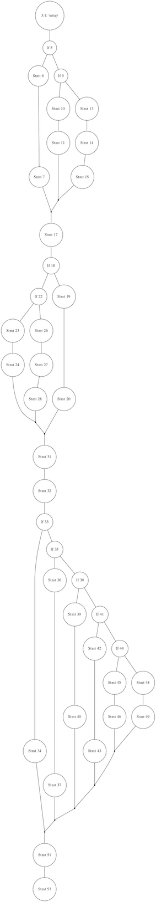

Title: Python code analysis using Prospector
Date: 2015-04-11 23:32
Author: 0x7df
Category: Programming
Tags: cyclomatic complexity, graph theory, mccabe, pep8, prospector, pylint, python, static analysis, yaml
Slug: python-code-analysis-using-prospector
Status: published

A [recent blog
post](https://blog.landscape.io/prospector-python-static-analysis-for-humans.html)
I came across introduced me to
[Prospector](https://github.com/landscapeio/prospector), a
[Python](https://www.python.org/) [static
analysis](http://en.wikipedia.org/wiki/Static_program_analysis) tool
developed by [Landscape](https://landscape.io/). From the
[documentation](https://prospector.readthedocs.org):

> Prospector is a tool to analyse Python code and output information
> about errors, potential problems, convention violations and
> complexity.
>
> It brings together the functionality of other Python analysis tools
> such as [Pylint](http://docs.pylint.org/),
> [pep8](http://pep8.readthedocs.org/en/latest/), and [McCabe
> complexity](https://pypi.python.org/pypi/mccabe).
>
> The primary aim of Prospector is to be useful ‘out of the box’. A
> common complaint of other Python analysis tools is that it takes a
> long time to filter through which errors are relevant or interesting
> to your own coding style. Prospector provides some default profiles,
> which hopefully will provide a good starting point and will be useful
> straight away, and adapts the output depending on the libraries your
> project uses.

So rather than configuring and individually using the various different
static analysis packages mentioned, and wading through the potentially
overwhelming output, Prospector provides a single interface to all of
them, and is set up to give a more manageable level of information
straight-away, without much user intervention. I won't repeat the sales
pitch and the basic how-to that [that
post](https://blog.landscape.io/prospector-python-static-analysis-for-humans.html)
contains, but will go on from there to give a bit more information.

* * * * *

Cyclomatic complexity
---------------------

The first thing you might come across that might not be self-evident is
the complexity rating given by the
[mccabe](https://github.com/flintwork/mccabe) package. E.g.:

    > prospector --strictness low  
    Messages  
    ========
    
    main.py  
      Line: 13  
        mccabe: MC0001 / run is too complex (17)
    
    Check Information  
    =================  
            Started: 2015-04-11 15:59:47.759944  
           Finished: 2015-04-11 15:59:51.598176  
         Time Taken: 3.84 seconds  
          Formatter: grouped  
           Profiles: default, strictness_low, strictness_medium,
    strictness_high, strictness_veryhigh, no_doc_warnings,
    no_test_warnings, no_member_warnings  
         Strictness: low  
     Libraries Used:  
          Tools Run: dodgy, mccabe, pep8, profile-validator, pyflakes,
    pylint  
     Messages Found: 1

The *cyclomatic complexity* metric was defined by [Thomas J. McCabe in a
1976
paper](http://ieeexplore.ieee.org/xpl/articleDetails.jsp?arnumber=1702388&filter%3DAND%28p_IS_Number%3A35895%29)
(the PDF of which can be found
[here](http://www.literateprogramming.com/mccabe.pdf), or reproduced in
the [book "Structured Testing" which is available on Google
Books](https://books.google.com/books?id=vtNWAAAAMAAJ)).
It is essentially a measure of the number of logical paths through a
piece of source code: the higher the number, the higher the complexity,
and therefore the more error-prone the code is likely to be. McCabe
suggested "10... seems like a reasonable, but not magical, upper limit".
The example given above was found to have a complexity of 17, so needs
simplifying (e.g by breaking up into more than one routine).

For more detail, the McCabe paper gives a very good description which is
hard to improve on:

> Given a program we will associate with it a directed graph that has
> unique entry and exit nodes [vertices]. Each node in the graph
> corresponds to a block of code in the program where the flow is
> sequential and the arcs [edges] correspond to branches taken in the
> program. This graph is classically known as the program control
> graph... and it is assumed that each node can be reached by the entry
> node and each node can reach the exit node. For example the following
> is a program control graph with entry node $ a$ and
> exit node $ f$:

> The following mathematical preliminaries will be needed...
>
> *Definition 1*: The cyclomatic number $ V(G)$ of a
> graph $ G$ with $ n$ vertices,
> $ e$ edges and $ p$ connected
> components is
>
> $$ V(G) = e - n + p $$
>
> *Theorem 1*: In a strongly connected graph $ G$ the
> cyclomatic number is equal to the maximum number of linearly
> independent circuits.

Note here that at this stage we are concerned with *circuits* - i.e.
closed loops that start at a given node and return back to that same
node - rather than *paths*.

> Theorem 1 is applied to $ G$ in the following way.
> Imagine that the exit node $ f$ branches back to the
> entry node $ a$. The control graph $ G$
> is now strongly connected (there is a path joining any
> pair of arbitrary distinct vertices) so Theorem 1 applies. Therefore
> the maximum number of linearly independent circuits in $ G$
> is $ 9 - 6 + 2$. For example one could
> choose the following 5 independent circuits in $ G$:
>
> $$ B1: (abefa), (beb), (abea), (acfa), (adcfa) $$
>
> It follows that $ B1$ forms a basis for the set of
> all circuits in $ G$ and any path through $ G$
> can be expressed as a linear combination of circuits from
> $ B1$. For instance the path $ (abeabebebef)$
> is expressible as $ (abea) + 2(beb) + (abefa)$.
>
> To see how this works it's necessary to number the edges on $ G$
> as in:

>

> Now for each member of the basis $ B1$ associate a
> vector as follows:

> The path $ (abea(be)^3fa)$ corresponds to the
> vector $ 2004200111$ and the vector addition of
> $ (abefa)$, $ 2(beb)$ and
> $ (abea)$ yields the desired result.
>
> In using Theorem 1 one can choose a basis set of circuits that
> correspond to paths through the program. The set $ B2$
> is a basis of program paths.
>
> $$ B2: (abef), (abeabef), (abebef), (acf), (adcf) $$
>
> Linear combination of paths in $ B2$ will also
> generate any path. For example:
>
> $$ (abea(be)^3f) = 2(abebef) - (abef) $$
>
> and:
>
> $$ (a(be)^2(abef) = (a(be)^2f) + (abeabef) - (abef) $$
>
> The overall strategy will be to measure the complexity of a program by
> computing the number of linearly independent paths $ V(G)$,
> control the size of programs by setting an upper limit
> to $ V(G)$ (instead of using just physical size),
> and use the cyclomatic complexity as the basis for a testing
> methodology.

If you want to run `mccabe` separately from `prospector` you can do,
using:

    > python -m mccabe mysourcefile.py  
    ('If 209', 2)  
    ("13:1: 'run'", 8)  

You can add the `-d` option (documented
[here](http://nedbatchelder.com/blog/200803/python_code_complexity_microtool.html))
to produce output that can be passed to the
[Graphviz](http://www.graphviz.org/) program
[dot](http://www.graphviz.org/pdf/dotguide.pdf), which will plot the
graph. I.e.:

    > python -m mccabe -d example.py | \\  
    dot -Tpng -o example.png  

produces something like this:

As well as using the cyclomatic complexity as a metric of whether a
particular piece of source code needs simplifying, it can also give an
indication of the number of tests that are required. If the number of
tests is less than the complexity metric, then clearly there must be
some paths through that are not being tested. Obviously, it doesn't
necessarily follow that, if the number of tests is equal to or greater
than the complexity, then all paths *are* being tested - more than one
test might be following a particular logical path. So having
$ V(G)$ tests for a particular routine $ G$
is necessary but not sufficient to ensure full coverage of all the
paths; but it seems like a good start.

Fine-tuning using profiles in Prospector
----------------------------------------

Probably one of the most useful aspects of Prospector is the ability to
fine-tune the warnings that are issued. For instance, once the
strictness level is up to medium or above, you might start to get a lot
of warnings from Pylint about invalid constant names:

    example.py  
    Line: 1  
    pylint: invalid-name / Invalid constant name "nmats"  
    Line: 17  
    pylint: invalid-name / Invalid constant name "dcoeff"  
    Line: 21  
    pylint: invalid-name / Invalid constant name "tpower"  
    Line: 23  
    pylint: invalid-name / Invalid constant name "tmp0"  
    ...  

The [PEP8 style guide](https://www.python.org/dev/peps/pep-0008)
suggests constants should be in upper case; I'm happy with this rule but
in most cases that were identified for a particular project I used a
trial run, I didn't regard the variable as a constant (e.g. like
$ \pi$, $ c$, $ h$,
etc.), but a variable that happens not to change - in a lot of the cases
just because the code is incomplete and, at some point down the line,
these will end up changing.

When we move to the `veryhigh` strictness level, another example that
comes up is trailing whitespace. I want to remove trailing whitespace
from lines of code; but because my editor automatically indents, *blank*
lines also get indented to the same level as the most recent non-blank
line. This whitespace on otherwise blank lines counts as trailing
whitespace, so I get far too many warning messages.

Thirdly, classes that have too few (fewer than two) public methods are
warned against; [the advice is that classes shouldn't be used for data
storage, but should include
functions](http://stackoverflow.com/questions/14027417/what-does-pylints-too-few-public-methods-message-mean).
If the only purpose is data storage, then a data structure like a
dictionary is more appropriate. However, again because of the
work-in-progress status of the code being analysed, I've defined certain
classes that currently only register data, but at some point
will include methods. So in the meantime I want to turn this check off.

The fine-tuning is done using profiles. A profile is just a
[YAML](http://yaml.org/) file with some configuration information, so you
can give different projects different rule sets by giving them their own
configuration file. An example is:

    strictness: veryhigh  
    ignore-paths: QA  
    pylint:  
    disable:  
    - invalid-name  
    - trailing-whitespace  
    - too-few-public-methods  

The really nice part is that configurations can inherit from other
configurations. For example, Prospector's different `--strictness`
options are really just different pre-defined profiles, and the example
above has been set up to inherit from the `--strictness veryhigh` profile.
The project-specific tweaks are:

- Ignore the directory called `QA` and its contents (which in this
  project contains temporary/intermediate files). This can also be
  achieved by using `--ignore-paths QA` on the command line.
- Disable the `invalid-name` messages from Pylint.
- Disable the `trailing-whitespace` messages from Pylint
- Disable the `too-few-public-methods` messages from Pylint

 Adding additional tools
------------------------

As well as the default tools (Pylint,
[pep8](https://pypi.python.org/pypi/pep8),
[pyflakes](https://pypi.python.org/pypi/pyflakes), mccabe,
[dodgy](https://github.com/landscapeio/dodgy) and profile_validator),
additional tools can be turned on either via the command line or by
adding them to a profile. The useful extra options are:

- [pep257](https://pypi.python.org/pypi/pep257), which checks that
  docstrings conform to the [PEP257 docstring conventions
  guide](https://www.python.org/dev/peps/pep-0257/). Use `--with-tool
  pep257` on the command line, or add `run: true` to a `pep257:`
  section in a profile file.
- [vulture](https://pypi.python.org/pypi/vulture), which checks for
  'dead code' (unused variables, functions, classes, etc.). This
  requires installation first, via `pip install
  prospector[with_vulture]`. (NB this syntax doesn't work in a [Z
  shell](http://zsh.sourceforge.net/).)
- [pyroma](https://pypi.python.org/pypi/pyroma), used for checking
  that Python packaging best practices are being followed. Requires
  `pip install prospector[with_pyroma]`. Note that using pyroma
  implies the use of pep257.

